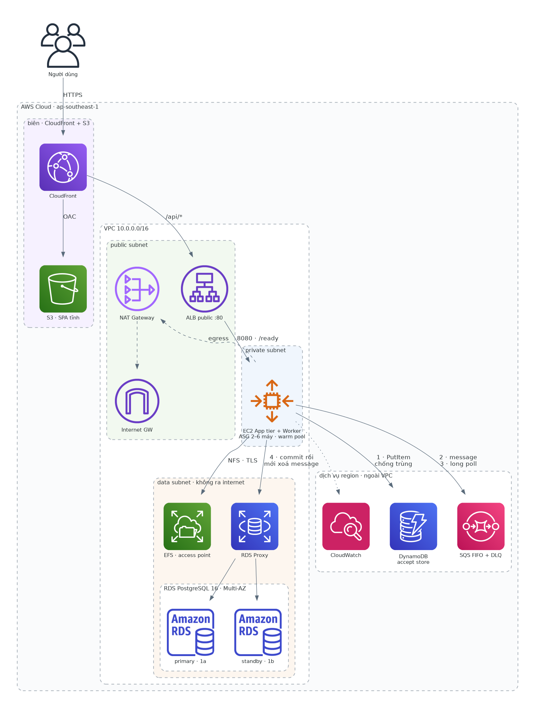

# On-Premise → AWS Migration — Reference Implementation

> A working migration target for a fictional manufacturing client: a B2B order
> system that survives concurrency, database outage, instance loss and cutover —
> built as Terraform, validated on live AWS. Docs are in Vietnamese.

Bài toán: một doanh nghiệp sản xuất khoảng 150 người dùng đang chạy Web tier,
Application tier và PostgreSQL trên ba máy vật lý riêng, mỗi tier chỉ một
instance, backup thủ công, không có DR, release thủ công. Traffic tăng 4–5 lần
vào cao điểm và hệ thống từng sập.

Repo này dựng hệ thống đích trên AWS, kèm một ứng dụng demo chạy được thật để có
cái mà migrate và mà kiểm thử.

---

## Chạy trong 3 lệnh

```bash
bash scripts/up.sh          # build, khởi động, seed 5.000 đơn
bash scripts/test-all.sh    # chạy ma trận test, xuất bằng chứng vào evidence/
open http://localhost:8080  # giao diện đặt hàng
```

Yêu cầu: Docker + Docker Compose. Không cần cài Python hay thư viện nào lên máy.

---

## Điều làm repo này khác một demo CRUD

Ứng dụng không được viết trước rồi mới nghĩ cách vận hành. Mỗi lựa chọn thiết kế
nhắm vào một ràng buộc phi chức năng cụ thể:

| # | Ràng buộc | Cách hiện thực |
|---|---|---|
| 1 | Chạy độc lập sau khi ngắt nguồn on-premise | Không còn phụ thuộc ngược |
| 2 | Migration khi vẫn phát sinh giao dịch, downtime ≤ 15 phút | Sổ cái đơn hàng đối chiếu trước/sau cutover |
| 3 | Không tạo đơn trùng | Accept store (DynamoDB) + `UNIQUE(idempotency_key)` |
| 3 | Không âm thầm ghi đè | Cột `version`, `UPDATE ... WHERE version = $expected` → 409 |
| 4 | Chịu tải 5x, p95 ≤ 2s, gián đoạn ≤ 2 phút | Tách tier, hàng đợi hấp thụ spike ghi, ASG + warm pool |
| 5 | DB chết 3 phút, tự hồi phục, không báo thành công giả | API trả **202**; worker chỉ xoá message sau khi commit |
| 6 | RPO ≤ 5 phút, RTO ≤ 30 phút | RDS PITR ra instance tạm rồi chèn ngược |
| 7 | File server giữ quyền theo phòng ban, thu hồi ≤ 5 phút | EFS access point + manifest checksum |
| 8 | Truy vết giao dịch, dựng lại được môi trường | `correlation_id` xuyên tier, bảng `order_events`, toàn bộ hạ tầng là Terraform |
| 9 | Kiểm soát chi phí, chịu được cắt 20% ngân sách | Hai bản sizing, đòn bẩy theo lịch chạy |
| 10 | Báo cáo song song không làm chậm OLTP | `REPEATABLE READ` trên replica, mốc chốt tường minh |

### Nguyên tắc cốt lõi

**API không bao giờ trả "thành công" trước khi database commit.**

```
POST /orders      →  202 Accepted   { order_id, status: "PENDING" }
                     ↑ mới chỉ là "đã nhận yêu cầu"

GET /orders/{id}  →  { status: "CONFIRMED" }
                     ↑ đây mới là giao dịch thành công
```

Cả chuỗi hệ quả đến từ đúng một quy tắc — *worker chỉ xoá message khỏi hàng đợi
sau khi transaction commit thành công*:

- DB chết → không commit được → message ở lại hàng đợi → đơn vẫn `PENDING` →
  không ai được báo thành công nhầm.
- DB hồi → worker (vẫn đang chạy, không ai restart) tự drain → không mất đơn.
- Message bị giao lại → `ON CONFLICT DO NOTHING` → không tạo đơn trùng.

---

## Kiến trúc

<p align="center">
  
</p>

Ba tầng subnet trên 2 AZ. Tầng data chỉ có route `local` — không gắn IGW cũng
không gắn NAT, nên RDS và EFS không có đường ra internet. Điều phân biệt tầng
`private` với tầng `data` là **route table**, không phải cái tên.

Sơ đồ sinh bằng [`docs/architecture.py`](docs/architecture.py) (thư viện
`diagrams` + graphviz, icon AWS chính thức). Bản sửa tay:
[`docs/architecture.drawio`](docs/architecture.drawio) — mở bằng
[draw.io](https://app.diagrams.net). Bản vector: [`docs/architecture.svg`](docs/architecture.svg).

```bash
pip install diagrams          # cần graphviz trên máy
python docs/architecture.py   # sinh lại architecture.png và architecture.svg
```

Môi trường local dựng đúng hình dạng này, để những gì test được ở đây vẫn còn ý
nghĩa khi lên cloud.

| Container local | Tương ứng trên AWS |
|---|---|
| `web` | **CloudFront + S3** — không phải EC2. Trang là SPA tĩnh, `/api/*` đi thẳng xuống ALB |
| `app` | ASG App tier, private subnet, sau ALB public |
| `worker` | Process riêng trên cùng ASG |
| `db` | RDS PostgreSQL Multi-AZ, truy cập qua RDS Proxy |
| `db-replica` | RDS read replica — chỉ phục vụ job báo cáo |
| `queue-db` | SQS FIFO (`orders.fifo`) + DynamoDB accept store |

`queue-db` **phải** là container riêng: trên AWS, SQS và DynamoDB độc lập hoàn
toàn với RDS. Nếu ở local để hàng đợi nằm chung database với bảng `orders` thì
khi chặn RDS để test outage, hàng đợi cũng chết theo và kịch bản mất hết ý nghĩa.

Chuyển sang dịch vụ AWS thật chỉ là đổi biến môi trường, không đổi code:

```bash
QUEUE_DRIVER=sqs              SQS_QUEUE_URL=https://sqs.ap-southeast-1.../orders.fifo
ACCEPT_STORE_DRIVER=dynamodb  DDB_ACCEPT_TABLE=abc-order-accept
DB_HOST=abc-rds-proxy.proxy-xxxx.ap-southeast-1.rds.amazonaws.com
```

---

## Kết quả đo được

Hạ tầng: **11 module Terraform**, `apply` 165 tài nguyên và `destroy` 165 tài
nguyên đều sạch — đây là bằng chứng cho ràng buộc #8.

### Chạy trên AWS thật

| Kịch bản | Ràng buộc | Kết quả |
|---|---|---|
| Gửi lại cùng mã đơn 5 lần | #3 | Đạt — đúng 1 `order_id` |
| 10 request đồng thời sửa 1 đơn | #3 | Đạt — 1 lần HTTP 200, 9 lần HTTP 409 |
| Thu hồi quyền file server | #7 | **Không đạt bằng cách đã thiết kế** — xem ghi chú dưới |
| Giết 1 instance App tier khi đang phục vụ | #4 | Đạt — gián đoạn 44 giây / ngân sách 120 giây |
| Cắt kết nối database 90 giây | #5 | Đạt vế chính — 0 đơn báo thành công sai, `/health` hồi 11 giây |
| Failover RDS Multi-AZ | #5 | Đạt — gián đoạn 13–20 giây, app và worker `NRestarts=0` |
| Khôi phục đơn bị xoá nhầm (PITR) | #6 | Đạt — RTO 12 phút 49 giây, RPO 5–7 phút, 50/50 đơn |

### Chạy ở local

| Kịch bản | Ràng buộc | Kết quả |
|---|---|---|
| Cutover khi vẫn có giao dịch | #2 | Ngừng dịch vụ 1,1 giây, 3.587 đơn khớp, tổng tiền khớp tuyệt đối |
| Phân quyền file server | #7 | 30/30 phép thử |
| Báo cáo song song + tải giao dịch | #10 | 5 job cùng checksum, p95 tạo đơn 61 ms |

Các con số p95 ở local nhỏ vì dataset chỉ 12.000 đơn — chúng chứng minh **hành
vi đúng**, chưa phải năng lực chịu tải thật.

---

## Hai chỗ thiết kế ban đầu sai, và cách sửa

Ghi lại vì đây là phần học được nhiều nhất.

**EFS không xét lại access point ở từng thao tác I/O.** Tài liệu đầu tiên viết
"xoá access point → mount đang mở mất quyền ở thao tác tiếp theo" — viết theo suy
luận, không đo. Đo thật thì mount đang mở vẫn đọc ghi bình thường suốt **283
giây**, vượt xa mốc 5 phút của ràng buộc #7. Quy trình phải đổi thành hai bước:
xoá access point (chặn mount mới) **và** ép `umount -f` qua SSM Run Command.

**Backoff ngắn hơn thời gian sự cố thì retry vô nghĩa.**
`release(msg, delay_seconds=5)` với `maxReceiveCount = 5` chỉ cho tổng ~25 giây
thử lại, trong khi ràng buộc #5 yêu cầu chịu được 3 phút mất kết nối — nên 1/5
đơn rơi vào DLQ. Sửa thành giãn dần `min(60 × receive_count, 600)`, tổng khoảng
10 phút.

---

## Còn thiếu

- **Test tải 5x trong 30 phút (#4)** — cần một EC2 riêng làm máy phát tải k6;
  chạy từ laptop qua internet thì p95 đo được là độ trễ đường truyền.
- **So sánh có/không RDS Proxy** — số hiện tại chỉ là số *có* proxy.
- **Chạy lại test outage sau khi sửa backoff** — bản sửa đã commit, chưa dựng lại
  hạ tầng để đo.
- **Ràng buộc #1** mới đạt về thiết kế — chưa cắt nguồn on-premise thật.

Hạ tầng cho cả ba bài đầu đã có sẵn trong Terraform, chỉ còn bước chạy và bấm giờ.

---

## Cấu trúc

| Thư mục | Nội dung |
|---|---|
| `app/` | Ứng dụng demo — App tier, Worker, Web tier (Python 3.12 + FastAPI) |
| `db/` | Schema PostgreSQL + trình sinh dữ liệu |
| `deploy/local/` | Docker Compose dựng topology giống AWS ở máy local |
| `deploy/terraform/` | 11 module, mỗi module có README riêng |
| `scripts/` | Script test từng ràng buộc, sinh tải, dựng file share |
| `loadtest/k6/` | Kịch bản k6 cho test chịu tải |
| `docs/ban-giao/` | Tài liệu kỹ thuật, runbook, kế hoạch triển khai, chi phí |

Bắt đầu từ [`docs/ban-giao/tai-lieu-ky-thuat.md`](docs/ban-giao/tai-lieu-ky-thuat.md)
— bản ngắn, viết cho người không cần biết AWS.

---

## Các lệnh hay dùng

```bash
# Môi trường
bash scripts/up.sh                       # dựng + seed
WITH_ONPREM=1 bash scripts/up.sh         # dựng thêm hệ thống nguồn để diễn tập cutover
bash scripts/reset.sh                    # xoá dữ liệu, seed lại
bash scripts/down.sh --volumes           # dọn sạch

# Test
bash scripts/test-all.sh                 # bộ nhanh (~4 phút)
FULL=1 bash scripts/test-all.sh          # test outage chạy đủ 180 giây
bash scripts/test-a2-idempotency.sh      # từng test riêng lẻ

# Chịu tải — k6 chạy trong Docker
bash scripts/loadtest.sh                     # smoke ~2,5 phút
PROFILE=full bash scripts/loadtest.sh        # 50 → 250 req/s trong 30 phút
```

Hạ tầng AWS: xem [`deploy/terraform/README.md`](deploy/terraform/README.md).
Profile AWS CLI mặc định là `abc-migration`, đổi bằng biến `AWS_PROFILE`.
