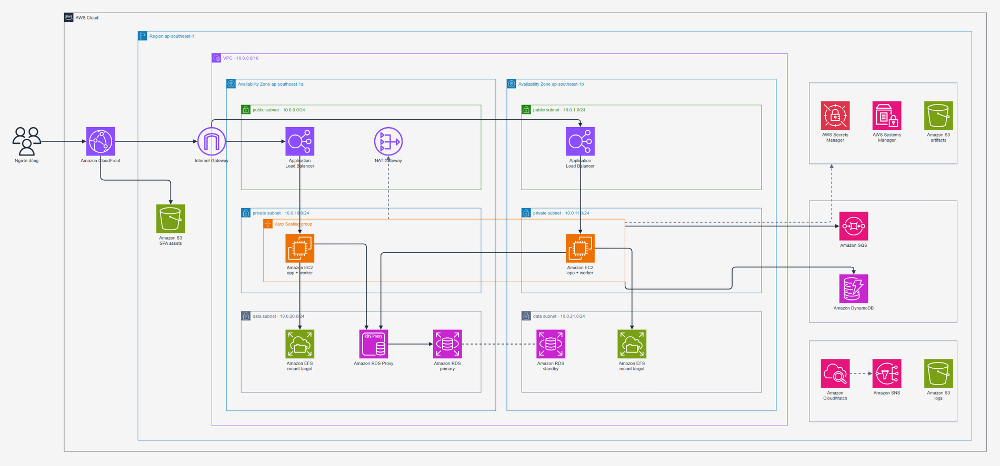
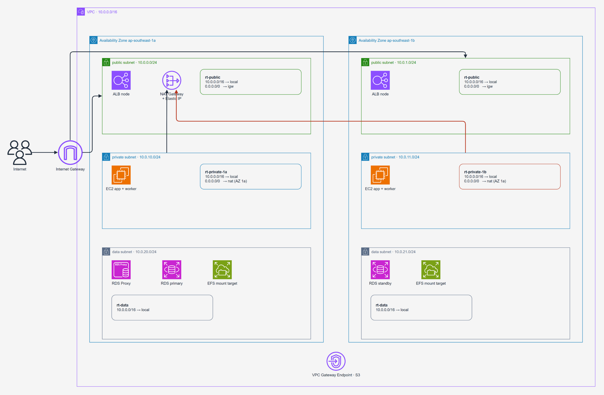
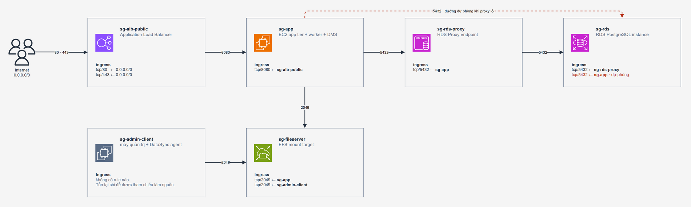
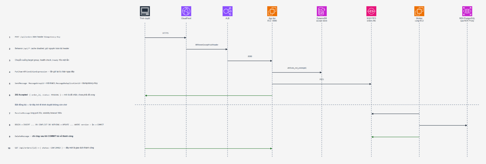
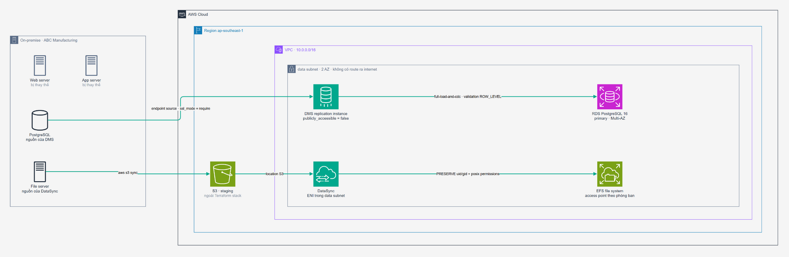
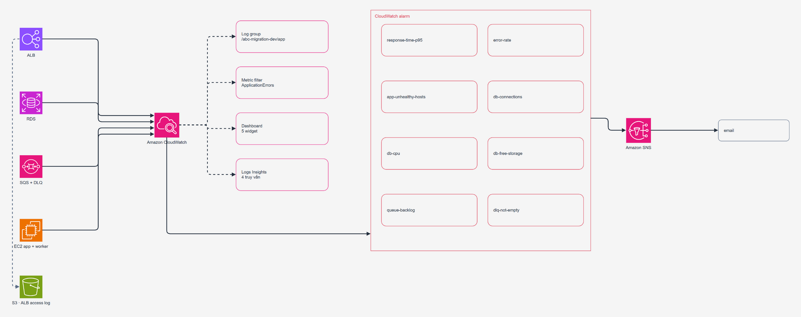

# On-Premise → AWS Migration — Reference Implementation

Hệ thống đặt hàng B2B chạy trên AWS, dựng hoàn toàn bằng Terraform, kèm một ứng dụng
demo chạy được thật để có cái mà migrate và mà kiểm thử. Toàn bộ tài liệu bằng tiếng Việt.

**Bài toán nguồn.** Một doanh nghiệp sản xuất ~150 người dùng đang chạy Web tier,
Application tier và PostgreSQL trên ba máy vật lý riêng — mỗi tier một instance, backup
thủ công, không DR, release thủ công. Traffic tăng 4–5 lần vào cao điểm và hệ thống từng sập.

**Phạm vi repo.** 11 module Terraform, `apply` 165 tài nguyên và `destroy` 165 tài nguyên
đều sạch. Ứng dụng demo Python 3.12 + FastAPI. Môi trường local bằng Docker Compose dựng
đúng topology của bản AWS.

| | |
|---|---|
| Region | `ap-southeast-1` |
| Name prefix | `abc-migration-dev` |
| Compute | EC2 `t4g.small` (Graviton), ASG 2–6, warm pool 2 |
| Database | RDS PostgreSQL 16.10 `db.t4g.micro`, Multi-AZ, qua RDS Proxy |
| Hàng đợi | SQS FIFO + DLQ |
| Chống đơn trùng | DynamoDB accept store |
| Web tier | CloudFront + S3 (SPA tĩnh) — không phải EC2 |
| File share | EFS, access point theo phòng ban |
| Migration | DMS `full-load-and-cdc` + DataSync |

---

## Chạy trong 3 lệnh

```bash
bash scripts/up.sh          # build, khởi động, seed 5.000 đơn
bash scripts/test-all.sh    # chạy ma trận test, xuất bằng chứng vào evidence/
open http://localhost:8080  # giao diện đặt hàng
```

Yêu cầu: Docker + Docker Compose. Không cần cài Python hay thư viện nào lên máy.

Hạ tầng AWS: xem [`deploy/terraform/README.md`](deploy/terraform/README.md).
Profile AWS CLI mặc định là `abc-migration`, đổi bằng biến `AWS_PROFILE`.

---

## Kiến trúc



Nguồn: [`docs/diagrams/architecture.drawio`](docs/diagrams/architecture.drawio)

Nguyên tắc chi phối toàn bộ thiết kế:

> **API không bao giờ trả "thành công" trước khi database commit.**

```
POST /api/orders       →  202 Accepted   { order_id, status: "PENDING" }
                          ↑ mới chỉ là "đã nhận yêu cầu"

GET  /api/orders/{id}  →  { status: "CONFIRMED" }
                          ↑ đây mới là giao dịch thành công
```

Cả chuỗi hành vi chịu lỗi đến từ đúng một quy tắc — *worker chỉ xoá message khỏi hàng
đợi sau khi transaction commit thành công*.

### Ba quyết định đáng chú ý

| Quyết định | Lý do |
|---|---|
| Web tier là **SPA tĩnh trên CloudFront + S3**, không phải EC2 | Vẫn tách biệt Web/App theo yêu cầu, tiết kiệm ~47 USD/tháng, bỏ hẳn một tầng phải vá lỗi |
| **DynamoDB + SQS nằm ngoài RDS** | Nếu accept store dùng chung database với bảng `orders`, thì khi RDS chết cơ chế chống đơn trùng cũng chết theo — đúng lúc cần nó nhất |
| **RDS Proxy** đứng giữa app và database | `db.t4g.micro` chịu được ~85 kết nối, ASG có thể lên 6 máy. Proxy gộp connection và giữ kết nối xuyên qua failover Multi-AZ |
| **Warm pool ở trạng thái `Stopped`** | Máy dự phòng sẵn sàng trong 30–40 giây thay vì 2–3 phút, chỉ tốn tiền ổ đĩa (~0,6 USD/tháng) |

---

## Mạng



Nguồn: [`docs/diagrams/network.drawio`](docs/diagrams/network.drawio)

| Tầng | CIDR | Route `0.0.0.0/0` | Chứa gì |
|---|---|---|---|
| `public` · 2 AZ | `10.0.0.0/24`, `10.0.1.0/24` | → Internet Gateway | ALB, NAT Gateway |
| `private` · 2 AZ | `10.0.10.0/24`, `10.0.11.0/24` | → NAT Gateway | EC2 App tier + Worker |
| `data` · 2 AZ | `10.0.20.0/24`, `10.0.21.0/24` | **không có** | RDS, RDS Proxy, EFS mount target, DMS, DataSync ENI |

Điều phân biệt tầng `private` với tầng `data` là **route table**, không phải cái tên.
Tầng `data` chỉ có route `local`; gộp hai tầng lại thì RDS và EFS mount target có đường
ra internet và mất hẳn tính tách biệt.

Chỉ có **một NAT Gateway**, đặt ở AZ `1a`, cả hai private subnet cùng route qua nó. Đây
là đánh đổi chi phí có chủ ý (~43 USD/tháng cho cái thứ hai): AZ `1a` chết thì private
`1b` mất đường ra internet, còn lưu lượng *đi vào* qua ALB không bị ảnh hưởng.

S3 Gateway Endpoint gắn vào cả bốn route table, nên lưu lượng tới S3 không đi qua NAT.
`map_public_ip_on_launch = false` trên cả hai public subnet.

---

## Security group



Nguồn: [`docs/diagrams/security-groups.drawio`](docs/diagrams/security-groups.drawio)

| Security group | Ingress | Từ đâu |
|---|---|---|
| `sg-alb-public` | `tcp/80`, `tcp/443` | `0.0.0.0/0` |
| `sg-app` | `tcp/8080` | `sg-alb-public` |
| `sg-rds-proxy` | `tcp/5432` | `sg-app` |
| `sg-rds` | `tcp/5432` | `sg-rds-proxy` **và** `sg-app` (đường dự phòng khi proxy lỗi) |
| `sg-fileserver` | `tcp/2049` | `sg-app`, `sg-admin-client` |
| `sg-admin-client` | — | không có ingress; tồn tại chỉ để được tham chiếu làm nguồn |

Chỉ `sg-alb-public` mở theo dải CIDR. Mọi rule còn lại dùng
`referenced_security_group_id`, nên thêm hay thay instance không phải sửa rule và không
có IP nào bị hard-code.

Cả sáu security group đều egress `all → 0.0.0.0/0`. Việc chặn chiều ra dựa vào route
table, không dựa vào security group.

---

## Vòng đời một đơn hàng



Nguồn: [`docs/diagrams/request-flow.drawio`](docs/diagrams/request-flow.drawio)

Hệ quả khi RDS mất kết nối:

- `COMMIT` không thành công → worker **không** gọi `DeleteMessage` → message ở lại hàng
  đợi → đơn vẫn `PENDING`. Không ai nhận được báo thành công sai.
- Hết visibility timeout 180s, SQS giao lại message. Backoff giãn dần
  `min(60 × receive_count, 600)` — tổng khoảng 10 phút.
- RDS sống lại → chính worker đó (không ai restart) tự drain hàng đợi. Message giao lại
  gặp `ON CONFLICT DO NOTHING` nên không tạo đơn trùng.
- Quá `maxReceiveCount = 5` → message rơi vào `orders-dlq.fifo`, giữ 14 ngày, alarm
  `dlq-not-empty` kêu ngay ở lần đầu tiên.

---

## Migration



Nguồn: [`docs/diagrams/migration.drawio`](docs/diagrams/migration.drawio)

| Nguồn | Công cụ | Đích |
|---|---|---|
| PostgreSQL on-premise | **DMS** `full-load-and-cdc`, replication instance trong data subnet, `publicly_accessible = false` | RDS PostgreSQL primary |
| File server on-premise | Đẩy lên **S3 staging** rồi **DataSync** đồng bộ | EFS file system |

Terraform dựng sẵn replication instance, hai endpoint và task, nhưng
`start_replication_task = false` — task **không** tự chạy, người vận hành bấm tay.

S3 staging **không** thuộc Terraform stack này: truyền vào bằng biến
`migration_files_bucket_arn`, quyền đọc cấp qua `datasync_role_arn`.

---

## Giám sát và truy vết



Nguồn: [`docs/diagrams/observability.drawio`](docs/diagrams/observability.drawio)

Log ứng dụng là JSON, mang `correlation_id` xuyên tier. App tier sinh id ngay khi nhận
request, gắn vào message SQS, worker log lại cùng id đó, và bảng `order_events` lưu id
vào từng bản ghi. Một truy vấn Logs Insights dựng lại được toàn bộ đường đi của đơn hàng.

`alarm_actions` và `ok_actions` đều trỏ vào cùng một SNS topic, nên khi sự cố kết thúc
cũng có thông báo.

---

## Thông số kỹ thuật

<details>
<summary><b>Compute — <code>modules/compute</code></b></summary>

| Tham số | Giá trị |
|---|---|
| AMI | Amazon Linux 2023, kernel mặc định, `arm64` (lấy từ SSM public parameter) |
| Instance type | `t4g.small` |
| ASG | `min 2` / `desired 2` / `max 6`, `availability_zone_distribution = balanced-best-effort` |
| Warm pool | `Stopped`, `min_size = 2`, `reuse_on_scale_in = true` |
| Scaling policy | Target tracking `ALBRequestCountPerTarget = 600` req/phút mỗi instance |
| Health check | `ELB`, grace 120s, `default_instance_warmup = 90s` |
| Instance refresh | Rolling, `min_healthy_percentage = 50`, warmup 120s |
| IMDS | `http_tokens = required`, `http_put_response_hop_limit = 1` (bắt buộc IMDSv2) |
| Root volume | 20 GiB `gp3`, mã hoá, `delete_on_termination` |
| ALB | internet-facing, `idle_timeout = 60`, `drop_invalid_header_fields = true`, access log vào S3 |
| Target group | `:8080`, health check `/ready` mỗi 10s, timeout 5s, ngưỡng 2/2, dereg delay 30s |

</details>

<details>
<summary><b>Database — <code>modules/data</code></b></summary>

| Tham số | Giá trị |
|---|---|
| Engine | PostgreSQL `16.10`, `db.t4g.micro` |
| Multi-AZ | bật · `publicly_accessible = false` |
| Storage | `gp3` 20 GiB, autoscale tới 100 GiB, `storage_encrypted = true` |
| Backup | giữ 7 ngày, cửa sổ `17:00–18:00`, `delete_automated_backups = false` |
| Maintenance | `sun:18:30–sun:19:30`, `auto_minor_version_upgrade = false` |
| Bảo vệ | `deletion_protection = !allow_destroy`, final snapshot khi không bật `allow_destroy` |
| Parameter group | `rds.force_ssl = 1`, `rds.logical_replication = 1`, `log_min_duration_statement = 500`, `log_lock_waits = 1`, `idle_in_transaction_session_timeout = 60000` |
| Log export | `postgresql`, `upgrade` · Performance Insights bật |
| RDS Proxy | `require_tls = true`, `idle_client_timeout = 1800`, pool `max_connections_percent = 90`, `max_idle = 50`, `connection_borrow_timeout = 120` |
| Credential | `random_password` 32 ký tự → Secrets Manager (proxy dùng) + SSM Parameter Store (`SecureString`) |

</details>

<details>
<summary><b>Hàng đợi — <code>modules/queue</code></b></summary>

| Tham số | Giá trị |
|---|---|
| Queue | `abc-migration-dev-orders.fifo` |
| FIFO | `deduplication_scope = messageGroup`, `fifo_throughput_limit = perMessageGroupId` |
| Dedup | `content_based_deduplication = false` — client đặt `MessageDeduplicationId` = `Idempotency-Key` |
| Visibility timeout | 180s · `receive_wait_time_seconds = 20` (long poll) |
| Max message size | 262.144 byte · `delay_seconds = 0` |
| Redrive | `maxReceiveCount = 5` → `abc-migration-dev-orders-dlq.fifo` |
| DLQ | giữ 14 ngày, `redrive_allow_policy` chỉ nhận từ queue chính |
| Mã hoá | `sqs_managed_sse_enabled` trên cả hai |

</details>

<details>
<summary><b>CDN và tài nguyên tĩnh — <code>modules/cdn</code>, <code>modules/static</code></b></summary>

| Tham số | Giá trị |
|---|---|
| Origin | 2 cái — S3 assets (qua OAC, SigV4) và ALB (custom origin) |
| Protocol | `http2and3`, viewer `redirect-to-https`, `PriceClass_200` |
| Behavior mặc định | → S3 · `CachingOptimized` + `CORS-S3Origin` + `SecurityHeadersPolicy` |
| Behavior `/api/*` | → ALB · `CachingDisabled` + `AllViewerExceptHostHeader`, đủ 7 method |
| SPA routing | `403` và `404` → `200` + `/index.html`, `error_caching_min_ttl = 10` |
| Bucket assets | block public access toàn phần, `BucketOwnerEnforced`, versioning, chỉ CloudFront đọc được qua policy có điều kiện `AWS:SourceArn` |

</details>

<details>
<summary><b>File share — <code>modules/fileserver</code></b></summary>

| Tham số | Giá trị |
|---|---|
| EFS | `generalPurpose`, `throughput_mode = elastic`, mã hoá |
| Lifecycle | chuyển IA sau 30 ngày, quay lại Standard sau 1 lần truy cập |
| Mount target | mỗi AZ một cái, dùng `sg-fileserver` |
| Access point phòng ban | uid/gid riêng, root `/<phòng ban>`, quyền `0770` |
| Access point chung | `/public`, uid 6000, gid 5000, `secondary_gids` = tất cả phòng ban, quyền `0775` |
| File system policy | `Deny` mọi thao tác khi `aws:SecureTransport = false`; chỉ `Allow` mount qua đúng danh sách access point |
| Backup | `aws_efs_backup_policy` bật |

</details>

---

## Ràng buộc đề bài → cách hiện thực

| # | Ràng buộc | Cách hiện thực |
|---|---|---|
| 1 | Chạy độc lập sau khi ngắt nguồn on-premise | Không còn phụ thuộc ngược |
| 2 | Migration khi vẫn phát sinh giao dịch, downtime ≤ 15 phút | DMS `full-load-and-cdc`, sổ cái đơn hàng đối chiếu trước/sau cutover |
| 3 | Không tạo đơn trùng | Accept store DynamoDB (`ConditionExpression`) + `UNIQUE(idempotency_key)` |
| 3 | Không âm thầm ghi đè | Cột `version`, `UPDATE ... WHERE version = $expected` → `409` |
| 4 | Chịu tải 5x, p95 ≤ 2s, gián đoạn ≤ 2 phút | Tách tier, hàng đợi hấp thụ spike ghi, ASG + warm pool |
| 5 | DB chết 3 phút, tự hồi phục, không báo thành công giả | API trả `202`; worker chỉ xoá message sau khi commit |
| 6 | RPO ≤ 5 phút, RTO ≤ 30 phút | RDS PITR ra instance tạm rồi chèn ngược |
| 7 | File server giữ quyền theo phòng ban, thu hồi ≤ 5 phút | EFS access point + manifest checksum |
| 8 | Truy vết giao dịch, dựng lại được môi trường | `correlation_id` xuyên tier, bảng `order_events`, toàn bộ hạ tầng là Terraform |
| 9 | Kiểm soát chi phí, chịu được cắt 20% ngân sách | Hai bản sizing, đòn bẩy theo lịch chạy |
| 10 | Báo cáo song song không làm chậm OLTP | `REPEATABLE READ` trên replica, mốc chốt tường minh |

---

## Kết quả đo được

### Trên AWS thật

| Kịch bản | Ràng buộc | Kết quả |
|---|---|---|
| Gửi lại cùng mã đơn 5 lần | #3 | Đạt — đúng 1 `order_id` |
| 10 request đồng thời sửa 1 đơn | #3 | Đạt — 1 lần `200`, 9 lần `409` |
| Thu hồi quyền file server | #7 | **Không đạt bằng cách đã thiết kế** — xem phần dưới |
| Giết 1 instance App tier khi đang phục vụ | #4 | Đạt — gián đoạn 44 giây / ngân sách 120 giây |
| Cắt kết nối database 90 giây | #5 | Đạt vế chính — 0 đơn báo thành công sai, `/health` hồi sau 11 giây |
| Failover RDS Multi-AZ | #5 | Đạt — gián đoạn 13–20 giây, app và worker `NRestarts=0` |
| Khôi phục đơn bị xoá nhầm (PITR) | #6 | Đạt — RTO 12 phút 49 giây, RPO 5–7 phút, 50/50 đơn |

### Ở local

| Kịch bản | Ràng buộc | Kết quả |
|---|---|---|
| Cutover khi vẫn có giao dịch | #2 | Ngừng dịch vụ 1,1 giây, 3.587 đơn khớp, tổng tiền khớp tuyệt đối |
| Phân quyền file server | #7 | 30/30 phép thử |
| Báo cáo song song + tải giao dịch | #10 | 5 job cùng checksum, p95 tạo đơn 61 ms |

Các con số p95 ở local nhỏ vì dataset chỉ 12.000 đơn — chúng chứng minh **hành vi đúng**,
chưa phải năng lực chịu tải thật.

---

## Hai chỗ thiết kế ban đầu sai

**EFS không xét lại access point ở từng thao tác I/O.** Tài liệu đầu tiên viết "xoá
access point → mount đang mở mất quyền ở thao tác tiếp theo" — viết theo suy luận, không
đo. Đo thật thì mount đang mở vẫn đọc ghi bình thường suốt **283 giây**, vượt xa mốc 5
phút của ràng buộc #7. Quy trình phải đổi thành hai bước: xoá access point (chặn mount
mới) **và** ép `umount -f` qua SSM Run Command.

**Backoff ngắn hơn thời gian sự cố thì retry vô nghĩa.** `release(msg, delay_seconds=5)`
với `maxReceiveCount = 5` chỉ cho tổng ~25 giây thử lại, trong khi ràng buộc #5 yêu cầu
chịu được 3 phút mất kết nối — nên 1/5 đơn rơi vào DLQ. Sửa thành giãn dần
`min(60 × receive_count, 600)`, tổng khoảng 10 phút.

---

## Còn thiếu

- **Test tải 5x trong 30 phút (#4)** — cần một EC2 riêng làm máy phát tải k6; chạy từ
  laptop qua internet thì p95 đo được là độ trễ đường truyền.
- **So sánh có/không RDS Proxy** — số hiện tại chỉ là số *có* proxy.
- **Chạy lại test outage sau khi sửa backoff** — bản sửa đã commit, chưa dựng lại hạ
  tầng để đo.
- **Ràng buộc #1** mới đạt về thiết kế — chưa cắt nguồn on-premise thật.

Hạ tầng cho cả ba bài đầu đã có sẵn trong Terraform, chỉ còn bước chạy và bấm giờ.

---

## Ánh xạ local ↔ AWS

Môi trường local dựng đúng hình dạng của bản AWS, để những gì test được ở đây vẫn còn ý
nghĩa khi lên cloud.

| Container local | Tương ứng trên AWS |
|---|---|
| `web` | **CloudFront + S3** — không phải EC2. Trang là SPA tĩnh, `/api/*` đi thẳng xuống ALB |
| `app` | ASG App tier, private subnet, sau ALB public |
| `worker` | Process riêng trên cùng ASG |
| `db` | RDS PostgreSQL Multi-AZ, truy cập qua RDS Proxy |
| `db-replica` | RDS read replica — chỉ phục vụ job báo cáo |
| `queue-db` | SQS FIFO (`orders.fifo`) + DynamoDB accept store |

`queue-db` **phải** là container riêng: trên AWS, SQS và DynamoDB độc lập hoàn toàn với
RDS. Nếu ở local để hàng đợi nằm chung database với bảng `orders` thì khi chặn RDS để
test outage, hàng đợi cũng chết theo và kịch bản mất hết ý nghĩa.

Chuyển sang dịch vụ AWS thật chỉ là đổi biến môi trường, không đổi code:

```bash
QUEUE_DRIVER=sqs              SQS_QUEUE_URL=https://sqs.ap-southeast-1.../orders.fifo
ACCEPT_STORE_DRIVER=dynamodb  DDB_ACCEPT_TABLE=abc-order-accept
DB_HOST=abc-rds-proxy.proxy-xxxx.ap-southeast-1.rds.amazonaws.com
```

---

## Module Terraform

| Module | Nội dung chính |
|---|---|
| `network` | VPC, 6 subnet, IGW, 1 NAT, 4 route table, S3 gateway endpoint |
| `security` | 6 security group, rule tham chiếu lẫn nhau |
| `iam` | Instance role (SSM Session Manager, CloudWatch agent, S3 artifacts), proxy role |
| `data` | RDS Multi-AZ, parameter group, RDS Proxy, Secrets Manager, 5 SSM parameter |
| `queue` | SQS FIFO, DLQ, redrive policy, DynamoDB accept table |
| `compute` | ALB, target group, launch template, ASG, warm pool, 2 S3 bucket, log group |
| `static` | S3 assets bucket, upload bản build với đúng content type |
| `cdn` | CloudFront 2 origin, OAC, cache policy, custom error response |
| `fileserver` | EFS, mount target, access point, file system policy, backup policy |
| `observability` | 8 alarm, SNS, metric filter, dashboard, 4 Logs Insights query |
| `migration` | DMS replication instance + endpoint + task, DataSync location + task |

Mỗi module có README riêng. Luồng đi xuyên hạ tầng: [`deploy/terraform/FLOW.md`](deploy/terraform/FLOW.md).

Biến cờ đáng chú ý: `create_cloudfront`, `create_rds_proxy`, `create_migration`,
`create_dms_service_roles`, `allow_destroy`. Terraform dừng trước khi động vào bất cứ thứ
gì nếu profile phân giải ra account khác `expected_account_id`.

---

## Cấu trúc

| Thư mục | Nội dung |
|---|---|
| `app/` | Ứng dụng demo — App tier, Worker, Web tier (Python 3.12 + FastAPI) |
| `db/` | Schema PostgreSQL + trình sinh dữ liệu |
| `deploy/local/` | Docker Compose dựng topology giống AWS ở máy local |
| `deploy/terraform/` | 11 module, mỗi module có README riêng |
| `docs/diagrams/` | Nguồn `.drawio` của 6 sơ đồ |
| `docs/img/` | PNG xuất ra, dùng trong README |
| `docs/ban-giao/` | Tài liệu kỹ thuật, runbook, kế hoạch triển khai, chi phí |
| `scripts/` | Script test từng ràng buộc, sinh tải, dựng file share |
| `loadtest/k6/` | Kịch bản k6 cho test chịu tải |

Bắt đầu từ [`docs/ban-giao/tai-lieu-ky-thuat.md`](docs/ban-giao/tai-lieu-ky-thuat.md) —
bản ngắn, viết cho người không cần biết AWS.

---

## Các lệnh hay dùng

```bash
# Môi trường
bash scripts/up.sh                       # dựng + seed
WITH_ONPREM=1 bash scripts/up.sh         # dựng thêm hệ thống nguồn để diễn tập cutover
bash scripts/reset.sh                    # xoá dữ liệu, seed lại
bash scripts/down.sh --volumes           # dọn sạch

# Test
bash scripts/test-all.sh                 # bộ nhanh (~4 phút)
FULL=1 bash scripts/test-all.sh          # test outage chạy đủ 180 giây
bash scripts/test-a2-idempotency.sh      # từng test riêng lẻ

# Chịu tải — k6 chạy trong Docker
bash scripts/loadtest.sh                     # smoke ~2,5 phút
PROFILE=full bash scripts/loadtest.sh        # 50 → 250 req/s trong 30 phút
```

---

## Sinh lại sơ đồ

File `.drawio` trong `docs/diagrams/` là nguồn duy nhất. Xuất PNG bằng draw.io Desktop:

```bash
for f in architecture network security-groups request-flow migration observability; do
  drawio -x -f png -b 24 --width 1900 -o "docs/img/$f.png" "docs/diagrams/$f.drawio"
done
```

Sơ đồ dùng bộ **AWS Architecture Icons** chính thức (thư viện `mxgraph.aws4`). Mở và sửa
bằng [app.diagrams.net](https://app.diagrams.net) hoặc draw.io Desktop.
