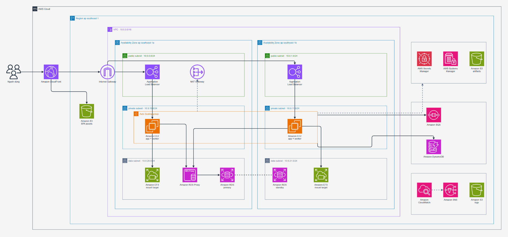
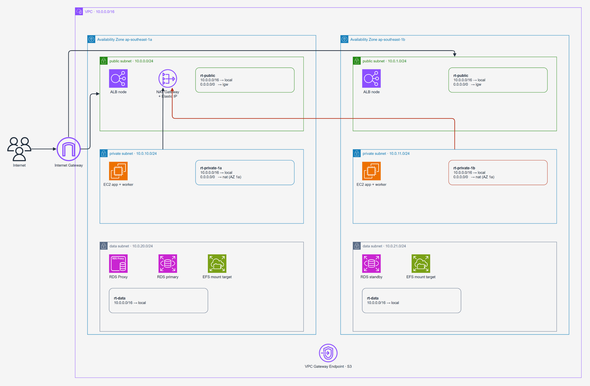
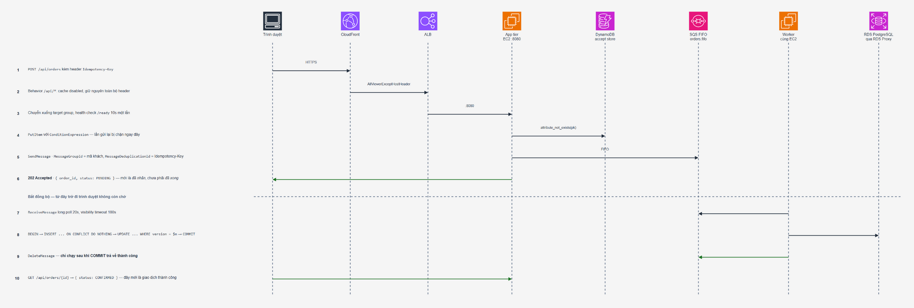

# Migration On-Premise → AWS

**[🇬🇧 Read in English →](README.md)**

Hệ thống đặt hàng ba tầng chạy on-premise, chuyển lên AWS không mất dữ liệu, dựng hoàn
toàn bằng Terraform. Kèm một ứng dụng chạy được thật để các kịch bản hỏng được **đo
đạc, không phải phát biểu**.


> **Phạm vi.** Repo này là phần **hạ tầng và migration**: Terraform dựng nền tảng đích, và
> đường DMS/DataSync đưa dữ liệu rời máy chủ cũ. Ứng dụng đóng vai *workload để kiểm thử*
> — nó tồn tại để có cái mà migrate thật, và có cái mà bắn chaos test vào.

---

## Bài toán

Một doanh nghiệp sản xuất ~150 người dùng chạy ba tầng Web, Application và PostgreSQL
trên ba máy vật lý riêng: backup thủ công, không DR, release thủ công. Traffic cao điểm
gấp 4–5 lần và hệ thống đã từng sập vì nó.

Migration phải diễn ra **trong lúc giao dịch vẫn phát sinh**, downtime ≤ 15 phút, không
mất và không trùng đơn nào.

Doanh nghiệp là giả định. Hạ tầng thì không — stack đã được dựng và huỷ trên tài khoản
AWS thật ngày 2026-09-11: `Apply complete! Resources: 165 added` →
`Destroy complete! Resources: 165 destroyed`, không sót tài nguyên nào.

| | |
|---|---|
| **Hạ tầng** | 11 module Terraform, 165 tài nguyên, `ap-southeast-1` |
| **Compute** | EC2 `t4g.small` (Graviton), ASG 2–6, warm pool 2 |
| **Database** | RDS PostgreSQL 16.10 `db.t4g.micro`, Multi-AZ, qua RDS Proxy |
| **Hàng đợi** | SQS FIFO + DLQ · DynamoDB accept store chống đơn trùng |
| **Web tier** | CloudFront + S3, SPA tĩnh — không phải EC2 |
| **File share** | EFS, access point theo phòng ban |
| **Migration** | DMS `full-load-and-cdc` + DataSync |
| **Ứng dụng** | Python 3.12 + FastAPI (app tier, worker, SPA) |

---

## Kiến trúc



Nguồn: [`docs/diagrams/architecture.drawio`](docs/diagrams/architecture.drawio) ·
cả sáu sơ đồ: [`docs/architecture.md`](docs/architecture.md)

### Ràng buộc ứng dụng mà hạ tầng phải đỡ

> **API không bao giờ báo thành công trước khi database commit.**

```
POST /api/orders       →  202 Accepted   { order_id, status: "PENDING" }
                          ↑ mới chỉ là "đã nhận yêu cầu"

GET  /api/orders/{id}  →  { status: "CONFIRMED" }
                          ↑ đây mới là giao dịch đã commit
```

Worker chỉ xoá message khỏi hàng đợi sau khi transaction commit thành công. Chính một
quy tắc đó quyết định hình dạng của nền tảng — mỗi dòng dưới đây là một tham số hạ tầng
được chọn để quy tắc ấy đứng vững:

| Quyết định hạ tầng | Sinh ra từ |
|---|---|
| SQS **FIFO** với `MessageDeduplicationId` = idempotency key, không dùng Standard | Message giao lại không được biến thành đơn thứ hai |
| Visibility timeout **180s**, backoff `min(60 × receive_count, 600)` | Thời gian thử lại phải dài hơn sự cố database 3 phút |
| DLQ ở `maxReceiveCount = 5`, giữ 14 ngày, alarm ngay message đầu tiên | Message hỏng 5 lần là việc của người vận hành, không phải việc của retry |
| DynamoDB accept store nằm **ngoài** RDS | Cơ chế chống trùng phải sống sót qua chính database nó bảo vệ |
| ALB target group gọi `/ready`, không gọi `/health` | Database mất kết nối không được khiến ASG terminate máy đang khoẻ |
| RDS Proxy đứng giữa app và database | Kết nối phải sống xuyên failover Multi-AZ mà không cần restart |

### Những quyết định đáng bảo vệ

| Quyết định | Lý do |
|---|---|
| Web tier là **SPA tĩnh trên CloudFront + S3**, không phải EC2 | Vẫn tách biệt Web/App, tiết kiệm ~47 USD/tháng, bỏ hẳn một bề mặt phải vá lỗi |
| **DynamoDB + SQS nằm ngoài RDS** | Nếu accept store dùng chung database với bảng `orders` thì khi RDS chết, cơ chế chống đơn trùng cũng chết theo — đúng lúc cần nó nhất |
| **RDS Proxy** đứng giữa app và database | `db.t4g.micro` chịu được ~85 kết nối, ASG có thể lên 6 máy. Proxy gộp connection và giữ kết nối xuyên qua failover Multi-AZ |
| **Warm pool ở trạng thái `Stopped`** | Máy dự phòng sẵn sàng trong 30–40 giây thay vì 2–3 phút, chỉ tốn tiền ổ đĩa (~0,6 USD/tháng) |

---

## Mạng



| Tầng | CIDR | Route `0.0.0.0/0` | Chứa gì |
|---|---|---|---|
| `public` · 2 AZ | `10.0.0.0/24`, `10.0.1.0/24` | Internet Gateway | ALB, NAT Gateway |
| `private` · 2 AZ | `10.0.10.0/24`, `10.0.11.0/24` | NAT Gateway | EC2 App tier + worker |
| `data` · 2 AZ | `10.0.20.0/24`, `10.0.21.0/24` | **không có** | RDS, RDS Proxy, EFS mount target, DMS, DataSync ENI |

Điều phân biệt tầng `private` với tầng `data` là **route table**, không phải cái tên.
Tầng `data` chỉ có route `local`; gộp hai tầng lại thì RDS và EFS mount target có đường
ra internet và mất hẳn tính tách biệt.

Chỉ có **một NAT Gateway**, đặt ở AZ `1a`, cả hai private subnet cùng route qua nó — đánh
đổi chi phí có chủ ý (~43 USD/tháng cho cái thứ hai). AZ `1a` chết thì private `1b` mất
đường ra internet, còn lưu lượng *đi vào* qua ALB không bị ảnh hưởng.

S3 Gateway Endpoint gắn vào cả bốn route table nên lưu lượng tới S3 không đi qua NAT.
`map_public_ip_on_launch = false` trên cả hai public subnet.

### Security group

| Security group | Ingress | Từ đâu |
|---|---|---|
| `sg-alb-public` | `tcp/80`, `tcp/443` | `0.0.0.0/0` |
| `sg-app` | `tcp/8080` | `sg-alb-public` |
| `sg-rds-proxy` | `tcp/5432` | `sg-app` |
| `sg-rds` | `tcp/5432` | `sg-rds-proxy` **và** `sg-app` (đường dự phòng khi proxy lỗi) |
| `sg-fileserver` | `tcp/2049` | `sg-app`, `sg-admin-client` |
| `sg-admin-client` | — | không có ingress; tồn tại chỉ để được tham chiếu làm nguồn |

Chỉ `sg-alb-public` mở theo dải CIDR. Mọi rule còn lại dùng
`referenced_security_group_id`, nên thêm hay thay instance không phải sửa rule và không
có IP nào bị hard-code. Cả sáu đều egress `all → 0.0.0.0/0` — việc chặn chiều ra dựa vào
route table, không dựa vào security group.
[Sơ đồ →](docs/img/security-groups.png)

---

## Hành vi khi hỏng



Khi RDS mất kết nối:

- `COMMIT` không thành công → worker **không** gọi `DeleteMessage` → message ở lại hàng
  đợi → đơn vẫn `PENDING`. Không ai nhận được báo thành công sai.
- Hết visibility timeout 180s, SQS giao lại message. Backoff giãn dần
  `min(60 × receive_count, 600)` — tổng khoảng 10 phút.
- RDS sống lại → chính worker đó (không ai restart) tự drain hàng đợi. Message giao lại
  gặp `ON CONFLICT DO NOTHING` nên không tạo đơn trùng.
- Quá `maxReceiveCount = 5` → message rơi vào `orders-dlq.fifo`, giữ 14 ngày, alarm
  `dlq-not-empty` kêu ngay ở lần đầu tiên.

---

## Migration

| Nguồn | Công cụ | Đích |
|---|---|---|
| PostgreSQL on-premise | **DMS** `full-load-and-cdc`, replication instance trong data subnet, `publicly_accessible = false` | RDS PostgreSQL primary |
| File server on-premise | Đẩy lên **S3 staging** rồi **DataSync** đồng bộ | EFS file system |

Terraform dựng sẵn replication instance, hai endpoint và task, nhưng
`start_replication_task = false` — task **không** tự chạy, người vận hành bấm tay. S3
staging cố ý nằm ngoài stack này: truyền vào bằng `migration_files_bucket_arn`, quyền
đọc cấp qua `datasync_role_arn`.

[Sơ đồ →](docs/img/migration.png) ·
[Quy trình chi tiết →](docs/ban-giao/migration/)

---

## Giám sát và truy vết

Log ứng dụng là JSON mang `correlation_id` xuyên tier. App tier sinh id ngay khi nhận
request, gắn vào message SQS, worker log lại cùng id đó, và bảng `order_events` lưu id
vào từng bản ghi — một truy vấn Logs Insights dựng lại toàn bộ đường đi của đơn hàng.

8 CloudWatch alarm, 4 Logs Insights query lưu sẵn, một dashboard, thông báo qua SNS.
`alarm_actions` và `ok_actions` trỏ cùng một topic nên khi sự cố kết thúc cũng có báo.
[Sơ đồ →](docs/img/observability.png)

---

## Kết quả đo được

Hệ thống được kiểm thử theo 10 ràng buộc tường minh. Các con số dưới đây là **đo được**,
không phải ước lượng.

### Hạ tầng và migration

| Kịch bản | Ràng buộc | Ở đâu | Kết quả |
|---|---|---|---|
| `terraform apply` rồi `destroy` | #8 | AWS | 165 tài nguyên dựng, 165 huỷ, không sót cái nào |
| Giết 1 instance App tier khi đang phục vụ | #4 | AWS | **Đạt** — gián đoạn 44 giây / ngân sách 120 giây |
| Cắt kết nối database 90 giây | #5 | AWS | **Đạt** — 0 đơn báo thành công sai, `/health` hồi sau 11 giây |
| Failover RDS Multi-AZ | #5 | AWS | **Đạt** — gián đoạn 13–20 giây, app và worker `NRestarts=0` |
| Khôi phục đơn bị xoá nhầm (PITR) | #6 | AWS | **Đạt** — RTO 12 phút 49 giây, RPO 5–7 phút, 50/50 đơn |
| Thu hồi quyền file server | #7 | AWS | **Không đạt bằng cách đã thiết kế** — xem dưới |
| Cutover khi vẫn có giao dịch | #2 | local | Ngừng dịch vụ 1,1 giây, 3.587 đơn khớp, tổng tiền khớp tuyệt đối |
| Ma trận phân quyền file server theo phòng ban | #7 | local | 30/30 |

### Hành vi ứng dụng chạy trên nền đó

| Kịch bản | Ràng buộc | Ở đâu | Kết quả |
|---|---|---|---|
| Gửi lại cùng Idempotency-Key 5 lần | #3 | AWS | **Đạt** — đúng 1 `order_id` |
| 10 request đồng thời sửa 1 đơn | #3 | AWS | **Đạt** — 1 lần `200`, 9 lần `409` |
| Báo cáo song song + tải giao dịch | #10 | local | 5 job cùng checksum, p95 tạo đơn 61 ms |
| Toàn bộ ma trận test (`scripts/test-all.sh`) | — | local | 21/21 đạt |

Các con số p95 ở local nhỏ vì dataset chỉ 12.000 đơn — chúng chứng minh **hành vi đúng**,
chưa phải năng lực chịu tải.

<details>
<summary><b>10 ràng buộc</b></summary>

| # | Ràng buộc | Cách hiện thực |
|---|---|---|
| 1 | Chạy độc lập sau khi ngắt nguồn on-premise | Không còn phụ thuộc ngược |
| 2 | Migration khi vẫn phát sinh giao dịch, downtime ≤ 15 phút | DMS `full-load-and-cdc`, sổ cái đơn hàng đối chiếu trước/sau cutover |
| 3 | Không tạo đơn trùng | Accept store DynamoDB (`ConditionExpression`) + `UNIQUE(idempotency_key)` |
| 3 | Không âm thầm ghi đè | Cột `version`, `UPDATE ... WHERE version = $expected` → `409` |
| 4 | Chịu tải 5x, p95 ≤ 2s, gián đoạn ≤ 2 phút | Tách tier, hàng đợi hấp thụ spike ghi, ASG + warm pool |
| 5 | DB chết 3 phút, tự hồi phục, không báo thành công giả | API trả `202`; worker chỉ xoá message sau khi commit |
| 6 | RPO ≤ 5 phút, RTO ≤ 30 phút | RDS PITR ra instance tạm rồi chèn ngược |
| 7 | File server giữ quyền theo phòng ban, thu hồi ≤ 5 phút | EFS access point + manifest checksum |
| 8 | Truy vết giao dịch, dựng lại được môi trường | `correlation_id` xuyên tier, bảng `order_events`, toàn bộ hạ tầng là Terraform |
| 9 | Kiểm soát chi phí, chịu được cắt 20% ngân sách | Hai bản sizing, đòn bẩy theo lịch chạy |
| 10 | Báo cáo song song không làm chậm OLTP | `REPEATABLE READ` trên replica, mốc chốt tường minh |

Ánh xạ đầy đủ: [`docs/ban-giao/anh-xa-rang-buoc.md`](docs/ban-giao/anh-xa-rang-buoc.md)

</details>

---

## Hai thiết kế bị phép đo chứng minh là sai

**EFS không xét lại access point ở từng thao tác I/O.** Bản tài liệu đầu tiên viết "xoá
access point → mount đang mở mất quyền ở thao tác tiếp theo" — viết theo suy luận, không
đo. Đo thật thì mount đang mở vẫn đọc ghi bình thường suốt **283 giây**, vượt xa mốc 5
phút của ràng buộc #7. Quy trình phải đổi thành hai bước: xoá access point (chặn mount
mới) **và** ép `umount -f` qua SSM Run Command.

**Backoff ngắn hơn thời gian sự cố thì retry vô nghĩa.** `release(msg, delay_seconds=5)`
với `maxReceiveCount = 5` chỉ cho tổng ~25 giây thử lại, trong khi ràng buộc #5 yêu cầu
chịu được 3 phút mất kết nối — nên 1/5 đơn rơi vào DLQ. Sửa thành giãn dần
`min(60 × receive_count, 600)`, tổng khoảng 10 phút.

## Còn thiếu

- **Test tải 5x trong 30 phút (#4)** — cần một EC2 riêng làm máy phát tải k6; chạy từ
  laptop qua internet thì p95 đo được là độ trễ đường truyền.
- **So sánh có/không RDS Proxy** — số hiện tại chỉ là số *có* proxy.
- **Chạy lại test outage sau khi sửa backoff** — bản sửa đã commit, chưa dựng lại hạ tầng
  để đo.
- **Ràng buộc #1** mới đạt về thiết kế — chưa cắt nguồn on-premise thật.

Hạ tầng cho cả ba bài đã có sẵn trong Terraform, chỉ còn bước chạy và bấm giờ.

---

## Chạy thử

### Ở local — ba lệnh

```bash
bash scripts/up.sh          # build, khởi động, seed 5.000 đơn
bash scripts/test-all.sh    # chạy ma trận test, xuất bằng chứng vào evidence/
open http://localhost:8080  # giao diện đặt hàng
```

Yêu cầu Docker và Docker Compose. Không cài gì lên máy host.

```bash
WITH_ONPREM=1 bash scripts/up.sh      # dựng thêm hệ thống nguồn để diễn tập cutover
FULL=1 bash scripts/test-all.sh       # test outage chạy đủ 180 giây
PROFILE=full bash scripts/loadtest.sh # k6: 50 → 250 req/s trong 30 phút
bash scripts/down.sh --volumes        # dọn sạch, xoá luôn dữ liệu
```

Topology local cố ý mô phỏng đúng bản AWS: `web` → CloudFront + S3, `app` → ASG sau ALB,
`worker` → process riêng cùng ASG, `db`/`db-replica` → RDS Multi-AZ + read replica, và
`queue-db` → SQS + DynamoDB. Hàng đợi **phải** là container riêng — trên AWS, SQS và
DynamoDB độc lập hoàn toàn với RDS, nên để chung thì kịch bản test DB outage mất hết ý
nghĩa.

Chuyển sang dịch vụ AWS thật chỉ là đổi biến môi trường, không đổi code:

```bash
QUEUE_DRIVER=sqs              SQS_QUEUE_URL=https://sqs.ap-southeast-1.../orders.fifo
ACCEPT_STORE_DRIVER=dynamodb  DDB_ACCEPT_TABLE=abc-order-accept
DB_HOST=abc-rds-proxy.proxy-xxxx.ap-southeast-1.rds.amazonaws.com
```

### Trên AWS

```bash
cd deploy/terraform
cp terraform.tfvars.example terraform.tfvars   # điền expected_account_id, alarm_email, ...
terraform init
terraform plan
terraform apply
```

Terraform dừng trước khi động vào bất cứ thứ gì nếu profile phân giải ra account khác
`expected_account_id`. Cờ bật tắt: `create_cloudfront`, `create_rds_proxy`,
`create_migration`, `create_dms_service_roles`, `allow_destroy`.
Hướng dẫn đầy đủ: [`deploy/terraform/README.md`](deploy/terraform/README.md)

---

## Cấu trúc

```
app/                  App tier, worker, SPA — Python 3.12 + FastAPI
db/                   Schema PostgreSQL + trình sinh dữ liệu
deploy/local/         Docker Compose dựng đúng topology của bản AWS
deploy/terraform/     11 module, mỗi module một README
docs/diagrams/        Nguồn .drawio (bộ AWS Architecture Icons chính thức)
docs/ban-giao/        Tài liệu kỹ thuật, runbook, kế hoạch triển khai, chi phí
scripts/              Script test từng ràng buộc, sinh tải, dựng file share
loadtest/k6/          Kịch bản k6 cho test chịu tải
```

| Module | Nội dung chính |
|---|---|
| `network` | VPC, 6 subnet, IGW, 1 NAT, 4 route table, S3 gateway endpoint |
| `security` | 6 security group, rule tham chiếu lẫn nhau |
| `iam` | Instance role (SSM Session Manager, CloudWatch agent, S3 artifacts), proxy role |
| `data` | RDS Multi-AZ, parameter group, RDS Proxy, Secrets Manager, 5 SSM parameter |
| `queue` | SQS FIFO, DLQ, redrive policy, DynamoDB accept table |
| `compute` | ALB, target group, launch template, ASG, warm pool, 2 S3 bucket, log group |
| `static` | S3 assets bucket, upload bản build với đúng content type |
| `cdn` | CloudFront 2 origin, OAC, cache policy, custom error response |
| `fileserver` | EFS, mount target, access point, file system policy, backup policy |
| `observability` | 8 alarm, SNS, metric filter, dashboard, 4 Logs Insights query |
| `migration` | DMS replication instance + endpoint + task, DataSync location + task |

Luồng đi xuyên hạ tầng — tạo đơn, database chết, một máy chết, scale out, release, báo
cáo song song, truy vết, thứ tự phụ thuộc giữa các module:
[`deploy/terraform/FLOW.md`](deploy/terraform/FLOW.md)

---

## Tài liệu

| Tài liệu | Nội dung |
|---|---|
| [tai-lieu-ky-thuat.md](docs/ban-giao/tai-lieu-ky-thuat.md) | Bản tổng quan, viết cho người không cần biết AWS — **bắt đầu từ đây** |
| [lua-chon-thiet-ke.md](docs/ban-giao/lua-chon-thiet-ke.md) | Chọn dịch vụ nào, đối thủ là gì, vì sao, và khi nào thì chọn ngược lại |
| [thong-so-ky-thuat.md](docs/ban-giao/thong-so-ky-thuat.md) | Tham chiếu đầy đủ tham số của từng dịch vụ |
| [runbook.md](docs/ban-giao/runbook.md) | Runbook vận hành |
| [anh-xa-rang-buoc.md](docs/ban-giao/anh-xa-rang-buoc.md) | Ràng buộc → cơ chế → cách chứng minh |
| [ke-hoach-trien-khai.md](docs/ban-giao/ke-hoach-trien-khai.md) | Kế hoạch triển khai |
| [chi-phi.md](docs/ban-giao/chi-phi.md) | Chi phí: báo giá khách hàng và môi trường demo |
| [quy-trinh-release.md](docs/ban-giao/quy-trinh-release.md) | Quy trình release |
| [huong-dan-console.md](docs/ban-giao/huong-dan-console.md) | Triển khai trên Console, theo đúng thứ tự |
| [scripts/SAFETY.md](scripts/SAFETY.md) | Quy tắc viết script dò quyền, rút ra sau khi một script làm hỏng tài nguyên thật |
